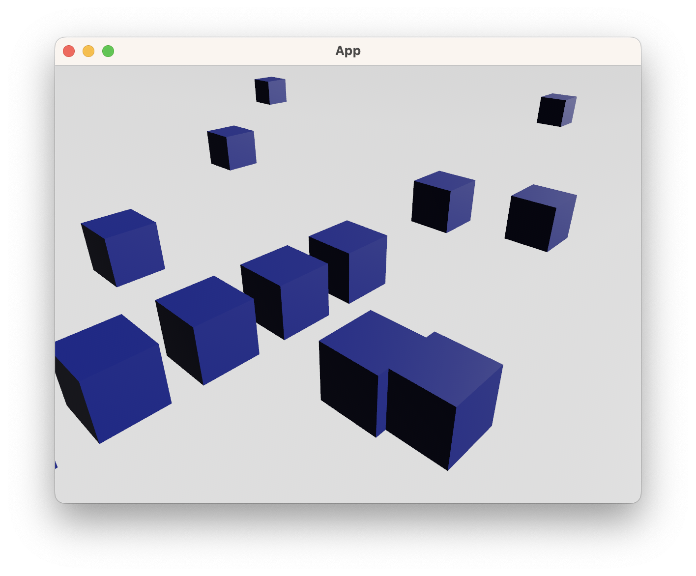

# Bevy For The Impatient

You have an idea for a game. You want to prototype it. You have some general
coding experience. You want to try using [Bevy](https://bevyengine.org/). This
book is (maybe) for you.

By the end, you will have this:

Yep, thats as far as this book goes for now. Stay tuned for further chapters (subject to interest).

Bevy is very extensible and flexible, which makes it powerful but also hard to
know where to get started. Many guides lay out all the different ways to use
bevy. This book instead uses a particular set of tools and approaches to get
things going as quickly and concisely as possible. They aren't the only way of
doing things, and the book is likely to evolve the chosen approaches over time.

## Navigation

[Next](1-install.md)

## Other resources

https://taintedcoders.com/

---

This work is licensed under [CC BY 4.0](http://creativecommons.org/licenses/by/4.0)
